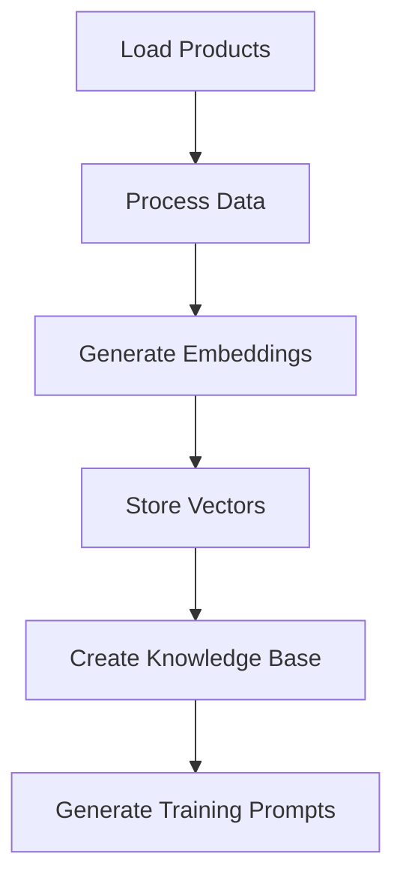

# KCT Menswear AI Training & Smart Filter System Guide

## 📋 Table of Contents
1. [System Overview](#system-overview)
2. [Smart Filter Engine](#smart-filter-engine)
3. [AI Training Pipeline](#ai-training-pipeline)
4. [Implementation Status](#implementation-status)
5. [Post-Launch Training Plan](#post-launch-training-plan)

---

## 🎯 System Overview

The KCT Menswear AI system consists of two major components:
1. **Smart Filter Engine** - Production-ready intelligent product filtering
2. **AI Training Pipeline** - Embedding generation and machine learning (ready for post-launch)

### Current Capabilities
- ✅ **Semantic Search** - Natural language product search
- ✅ **AI Scoring** - Intelligent product ranking
- ✅ **Personalized Recommendations** - User preference matching
- ✅ **Outfit Builder** - Coordinated outfit suggestions
- ✅ **Smart Filtering** - Multi-criteria intelligent filtering

---

## 🤖 Smart Filter Engine

### Location
`/src/lib/ai/smart-filter-engine.ts`

### API Endpoint
`/api/ai/smart-filter`

### Features

#### 1. Basic Filtering
```typescript
{
  categories: ['suits', 'shirts'],
  colors: ['navy', 'white'],
  sizes: ['40R', '42R'],
  priceRange: { min: 200, max: 500 },
  occasions: ['wedding', 'business']
}
```

#### 2. AI-Powered Features
```typescript
{
  searchQuery: "navy blue wedding suit",     // Semantic search
  similarToProductId: "product-123",         // Find similar items
  userPreferences: {                         // Personalization
    favoriteColors: ['navy', 'grey'],
    pricePreference: 'premium',
    styleProfile: 'modern'
  },
  seasonalRelevance: true,                   // Seasonal scoring
  trendingOnly: false,                       // Trending filter
  includeOutfitSuggestions: true            // Outfit builder
}
```

#### 3. Response Structure
```typescript
{
  products: UnifiedProduct[],          // Filtered & scored products
  suggestions: FilterSuggestion[],      // Smart filter suggestions
  alternativeFilters: AlternativeFilter[], // Alternative searches
  outfitSuggestions: OutfitSuggestion[],  // Matching outfits
  metadata: {
    totalMatches: number,
    searchTime: number,
    aiScoreRange: { min, max },
    priceRange: { min, max },
    topCategories: [],
    topColors: []
  }
}
```

### Usage Examples

#### Basic Search
```javascript
// Search for navy suits under $400
POST /api/ai/smart-filter
{
  "categories": ["suits"],
  "colors": ["navy"],
  "priceRange": { "min": 0, "max": 400 }
}
```

#### Personalized Recommendations
```javascript
// Get personalized recommendations
POST /api/ai/smart-filter
{
  "userPreferences": {
    "favoriteColors": ["navy", "grey"],
    "pricePreference": "premium",
    "styleProfile": "modern",
    "occasions": ["business", "wedding"]
  },
  "seasonalRelevance": true,
  "maxResults": 10
}
```

#### Outfit Building
```javascript
// Find complete outfit for prom
POST /api/ai/smart-filter
{
  "occasions": ["prom"],
  "categories": ["suits", "tuxedos"],
  "includeOutfitSuggestions": true,
  "maxResults": 5
}
```

### AI Scoring Algorithm

Products are scored based on:
1. **Text Relevance** (0-20 points) - Keyword matching
2. **User Preferences** (0-15 points) - Personal style matching
3. **Seasonal Relevance** (0-10 points) - Current season matching
4. **Trending Status** (0-10 points) - Popular items boost
5. **Value Score** (0-5 points) - Price/quality ratio

Total score range: 0-100

---

## 🎓 AI Training Pipeline

### Location
`/src/ai-training/`

### Components

#### 1. Training Pipeline (`train.ts`)
Main orchestrator for the training process:
```typescript
npm run train:ai  // Run training pipeline
```

#### 2. Data Processor (`data/processor.ts`)
- Loads product data from Supabase
- Processes and normalizes product information
- Generates training datasets

#### 3. Embeddings Generator (`embeddings/generator.ts`)
- Creates vector embeddings using OpenAI
- Delta-aware training (only processes changed products)
- Batch processing for efficiency

#### 4. Vector Store (`embeddings/vector-store.ts`)
- Stores embeddings in vector database
- Enables semantic search
- Supports similarity queries

### Training Process



### Configuration Required

#### Environment Variables
```env
# OpenAI Configuration
OPENAI_API_KEY=your-api-key
OPENAI_EMBEDDING_MODEL=text-embedding-3-small

# Vector Database (Qdrant)
QDRANT_URL=your-qdrant-url
QDRANT_API_KEY=your-qdrant-key
QDRANT_COLLECTION=kct-products

# Or Pinecone
PINECONE_API_KEY=your-pinecone-key
PINECONE_ENVIRONMENT=your-environment
PINECONE_INDEX=kct-products
```

---

## ✅ Implementation Status

### Production Ready ✅
- Smart Filter Engine
- API Endpoints
- Basic AI Scoring
- Category Filtering
- Outfit Suggestions
- Search Functionality

### Ready for Training 🎓
- Training Pipeline Structure
- Embeddings Generator
- Vector Store Integration
- Delta Training Support
- Batch Processing

### Post-Launch Implementation 📅
- Vector Database Setup
- OpenAI API Integration
- Embedding Generation
- User Preference Learning
- Advanced ML Models

---

## 📅 Post-Launch Training Plan

### Phase 1: Initial Setup (Week 1 Post-Launch)
1. **Configure Vector Database**
   - Set up Qdrant or Pinecone
   - Configure authentication
   - Create collections/indexes

2. **Generate Initial Embeddings**
   ```bash
   npm run train:ai
   ```
   - Process all products
   - Generate embeddings
   - Store in vector database

3. **Enable Semantic Search**
   - Activate vector search in API
   - Test similarity queries
   - Monitor performance

### Phase 2: User Learning (Week 2-4)
1. **Implement Analytics Tracking**
   - User interactions
   - Search queries
   - Purchase patterns
   - Filter usage

2. **Build Preference Profiles**
   - Store user preferences
   - Track favorite items
   - Learn style patterns

3. **A/B Testing**
   - Test AI recommendations
   - Compare with baseline
   - Optimize scoring

### Phase 3: Advanced Features (Month 2)
1. **Visual Search**
   - Image embedding generation
   - Similar product finding
   - Style matching

2. **Trend Prediction**
   - Analyze purchase patterns
   - Predict upcoming trends
   - Stock optimization

3. **Dynamic Pricing**
   - Demand-based pricing
   - Personalized offers
   - Bundle optimization

---

## 🛠️ Maintenance & Monitoring

### Daily Tasks
- Monitor API performance
- Check error rates
- Review search quality

### Weekly Tasks
- Retrain embeddings for new products
- Update seasonal scores
- Review user feedback

### Monthly Tasks
- Full embedding regeneration
- Model performance evaluation
- A/B test analysis

---

## 📊 Success Metrics

### Search Quality
- Click-through rate > 30%
- Conversion rate > 5%
- Zero-result searches < 5%

### Recommendation Performance
- Acceptance rate > 20%
- Cross-sell success > 15%
- Bundle attachment > 10%

### User Engagement
- Filter usage > 40%
- Search refinements < 3
- Time to purchase < 5 minutes

---

## 🚀 Quick Start Commands

```bash
# Test smart filter
node test-smart-filter.js

# Test API endpoints
node test-api-products.js

# Run training pipeline (post-launch)
npm run train:ai

# Generate embeddings only
npm run embeddings:generate

# Update vector store
npm run vectors:update
```

---

## 📝 Notes for Launch

### Before Launch
✅ Smart filter engine is ready
✅ API endpoints are functional
✅ Basic filtering works
✅ Products load from Supabase

### After Launch
1. Set up OpenAI API key
2. Configure vector database
3. Run initial training
4. Monitor and optimize
5. Implement user learning

---

## 🔗 Related Documentation

- [AI Systems Overview](./AI_SYSTEMS_OVERVIEW.md)
- [API Documentation](./docs/api/README.md)
- [Database Schema](./docs/database/schema.md)
- [Frontend Integration](./docs/frontend/ai-integration.md)

---

## 💡 Tips for Success

1. **Start Simple** - Use basic filtering first, add AI features gradually
2. **Monitor Performance** - Track API response times and accuracy
3. **Collect Feedback** - User feedback is crucial for training
4. **Iterate Quickly** - Small improvements compound over time
5. **Privacy First** - Always anonymize user data for training

---

## 📞 Support

For questions about the AI system:
- Technical Issues: Check error logs in `/logs/ai/`
- Training Problems: Review `/src/ai-training/.cache/`
- API Errors: Check `/api/ai/smart-filter` endpoint logs

---

*Last Updated: 2025-08-13*
*Version: 1.0.0*
*Status: Production Ready (Smart Filter) | Training Ready (Post-Launch)*