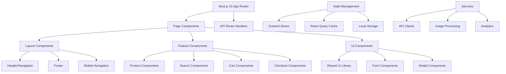

# KCT Menswear Enhanced Products System - Frontend Architecture

**Architecture Version:** 1.0  
**Last Updated:** August 15, 2025  
**Framework:** Next.js 15 with React 19

## Table of Contents

1. [Architecture Overview](#architecture-overview)
2. [Component Hierarchy](#component-hierarchy)
3. [State Management](#state-management)
4. [Hooks and Utilities](#hooks-and-utilities)
5. [Image Optimization](#image-optimization)
6. [Mobile Responsiveness](#mobile-responsiveness)
7. [Performance Optimizations](#performance-optimizations)
8. [Code Organization](#code-organization)
9. [Development Patterns](#development-patterns)
10. [Testing Strategy](#testing-strategy)

---

## Architecture Overview

### System Design Philosophy

The frontend architecture follows a **hybrid component strategy** that seamlessly handles both legacy and enhanced products through unified interfaces while maintaining optimal performance and user experience.



### Core Technologies

- **Framework:** Next.js 15 (App Router)
- **UI Library:** React 19
- **Styling:** Tailwind CSS
- **State Management:** Zustand + React Query
- **Type Safety:** TypeScript 5
- **Animation:** Framer Motion
- **Image Processing:** Next.js Image + Sharp
- **Icons:** Lucide React + React Icons
- **Forms:** React Hook Form + Zod validation

---

## Component Hierarchy

### Page-Level Architecture

```
src/app/
├── layout.tsx                    # Root layout with providers
├── page.tsx                      # Homepage
├── products/
│   ├── page.tsx                  # Products listing (hybrid)
│   ├── [id]/
│   │   ├── page.tsx              # Product detail (hybrid)
│   │   ├── EnhancedUnifiedDetail.tsx
│   │   ├── ModernProductDetail.tsx
│   │   └── ProductDetailClient.tsx
├── collections/
│   ├── page.tsx                  # Collections overview
│   ├── [category]/
│   │   └── page.tsx              # Category-specific collections
├── cart/
│   └── page.tsx                  # Shopping cart
├── checkout/
│   ├── page.tsx                  # Checkout process
│   └── success/
│       └── page.tsx              # Order confirmation
└── api/
    ├── products/
    │   ├── enhanced/
    │   ├── search/
    │   └── unified/
    └── checkout/
```

### Component Structure

#### Product Components Hierarchy

```typescript
// Hybrid Product System
HybridProductPage                 // Universal product page
├── EnhancedProductDetail         // For enhanced products
│   ├── EnhancedImageGallery      // CDN-optimized gallery
│   ├── PricingTierDisplay        // 20-tier visualization
│   ├── CustomizationOptions      // Product customization
│   ├── VariantSelector           // Size/color/style selection
│   ├── InventoryIndicator        // Stock level display
│   └── AddToCartButton           // Enhanced cart integration
├── LegacyProductDetail           // For legacy products
│   ├── StandardImageGallery      // R2 bucket images
│   ├── BundleOptions             // Bundle-specific options
│   └── LegacyCartButton          // Legacy cart integration
└── SharedComponents              // Common functionality
    ├── ProductBreadcrumbs
    ├── ProductSEO
    ├── RecommendedProducts
    └── ProductReviews
```

#### Enhanced Product Card Component

```typescript
// src/components/products/enhanced/EnhancedProductCard.tsx
interface EnhancedProductCardProps {
  product: EnhancedProduct;
  variant?: 'default' | 'compact' | 'featured';
  showPricingTier?: boolean;
  showQuickActions?: boolean;
  showInventoryStatus?: boolean;
  onClick?: (product: EnhancedProduct) => void;
}

export function EnhancedProductCard({
  product,
  variant = 'default',
  showPricingTier = true,
  showQuickActions = false,
  showInventoryStatus = true,
  onClick
}: EnhancedProductCardProps) {
  const { addToCart, isInCart } = useCart();
  const { trackProductView } = useAnalytics();
  
  // Component logic and JSX
}
```

#### Image Gallery Component

```typescript
// src/components/products/enhanced/EnhancedImageGallery.tsx
interface EnhancedImageGalleryProps {
  images: ProductImageGallery;
  selectedVariant?: string;
  enableZoom?: boolean;
  enableFullscreen?: boolean;
  className?: string;
}

export function EnhancedImageGallery({
  images,
  selectedVariant,
  enableZoom = true,
  enableFullscreen = true,
  className
}: EnhancedImageGalleryProps) {
  const [currentImageIndex, setCurrentImageIndex] = useState(0);
  const [isFullscreenOpen, setIsFullscreenOpen] = useState(false);
  const [isZoomed, setIsZoomed] = useState(false);
  
  // Variant-aware image selection
  const currentImages = useMemo(() => {
    if (selectedVariant) {
      const variantSet = images.variants?.find(
        v => v.variant_name === selectedVariant
      );
      return variantSet ? [variantSet.images[0], ...images.gallery] : [images.primary, ...images.gallery];
    }
    return [images.primary, ...images.gallery];
  }, [images, selectedVariant]);
  
  // Component implementation
}
```

### Collection Components

```typescript
// Dynamic Master Collection System
export const MasterCollectionPage = dynamic(
  () => import('@/components/collections/DynamicMasterCollection'),
  { 
    loading: () => <ProductGridSkeleton />,
    ssr: true 
  }
);

// Collection Architecture
DynamicMasterCollection
├── CollectionHeader              // SEO-optimized header
├── FilterPanel                   // Advanced filtering
│   ├── CategoryFilters
│   ├── PriceRangeSlider
│   ├── BrandFilter
│   ├── FeatureFilter
│   └── AvailabilityFilter
├── ProductGrid                   // Hybrid product display
│   ├── EnhancedProductCard       // Enhanced products
│   ├── LegacyProductCard         // Legacy products
│   └── UniversalLargeCard        // Unified display
└── Pagination                    // Performance-optimized pagination
```

---

## State Management

### Zustand Store Architecture

#### Product Store

```typescript
// src/lib/store/productStore.ts
interface ProductState {
  // Enhanced Products
  enhancedProducts: EnhancedProduct[];
  enhancedProductsLoading: boolean;
  enhancedProductsError: string | null;
  
  // Legacy Products
  legacyProducts: UnifiedProduct[];
  legacyProductsLoading: boolean;
  
  // Unified State
  searchResults: HybridProductResult[];
  searchLoading: boolean;
  searchQuery: string;
  
  // Actions
  fetchEnhancedProducts: (query?: EnhancedProductQuery) => Promise<void>;
  fetchLegacyProducts: () => Promise<void>;
  searchAllProducts: (query: HybridProductQuery) => Promise<void>;
  clearSearch: () => void;
  
  // Selectors
  getProductBySlug: (slug: string) => EnhancedProduct | UnifiedProduct | null;
  getProductsByCategory: (category: string) => (EnhancedProduct | UnifiedProduct)[];
}

export const useProductStore = create<ProductState>((set, get) => ({
  // State initialization
  enhancedProducts: [],
  enhancedProductsLoading: false,
  enhancedProductsError: null,
  legacyProducts: [],
  legacyProductsLoading: false,
  searchResults: [],
  searchLoading: false,
  searchQuery: '',
  
  // Actions implementation
  fetchEnhancedProducts: async (query) => {
    set({ enhancedProductsLoading: true, enhancedProductsError: null });
    try {
      const response = await fetch('/api/products/enhanced?' + new URLSearchParams(query));
      const data = await response.json();
      set({ enhancedProducts: data.products, enhancedProductsLoading: false });
    } catch (error) {
      set({ enhancedProductsError: error.message, enhancedProductsLoading: false });
    }
  },
  
  searchAllProducts: async (query) => {
    set({ searchLoading: true, searchQuery: query.search_term || '' });
    try {
      const response = await fetch('/api/products/search', {
        method: 'POST',
        headers: { 'Content-Type': 'application/json' },
        body: JSON.stringify(query)
      });
      const data = await response.json();
      set({ searchResults: data.products, searchLoading: false });
    } catch (error) {
      set({ searchResults: [], searchLoading: false });
    }
  },
  
  // Selectors
  getProductBySlug: (slug) => {
    const { enhancedProducts, legacyProducts } = get();
    return enhancedProducts.find(p => p.slug === slug) || 
           legacyProducts.find(p => p.id === slug) || 
           null;
  }
}));
```

#### Cart Store

```typescript
// src/lib/store/cartStore.ts
interface CartItem {
  id: string;
  productId: string;
  productType: 'enhanced' | 'legacy';
  name: string;
  price: number;
  quantity: number;
  image: string;
  
  // Enhanced product specific
  selectedVariants?: ProductVariant[];
  customizations?: ProductCustomization[];
  
  // Legacy product specific
  bundleComponents?: BundleComponent[];
}

interface CartState {
  items: CartItem[];
  isOpen: boolean;
  loading: boolean;
  
  // Actions
  addItem: (item: Omit<CartItem, 'id'>) => void;
  removeItem: (itemId: string) => void;
  updateQuantity: (itemId: string, quantity: number) => void;
  clearCart: () => void;
  setIsOpen: (isOpen: boolean) => void;
  
  // Computed
  totalItems: number;
  totalPrice: number;
  
  // Persistence
  hydrate: () => void;
  persist: () => void;
}

export const useCartStore = create<CartState>()(
  persist(
    (set, get) => ({
      items: [],
      isOpen: false,
      loading: false,
      
      addItem: (newItem) => {
        const items = get().items;
        const existingItem = items.find(item => 
          item.productId === newItem.productId && 
          JSON.stringify(item.selectedVariants) === JSON.stringify(newItem.selectedVariants)
        );
        
        if (existingItem) {
          set({
            items: items.map(item =>
              item.id === existingItem.id
                ? { ...item, quantity: item.quantity + newItem.quantity }
                : item
            )
          });
        } else {
          set({
            items: [...items, { ...newItem, id: generateCartItemId() }]
          });
        }
        
        get().persist();
      },
      
      get totalItems() {
        return get().items.reduce((total, item) => total + item.quantity, 0);
      },
      
      get totalPrice() {
        return get().items.reduce((total, item) => total + (item.price * item.quantity), 0);
      },
      
      persist: () => {
        if (typeof window !== 'undefined') {
          localStorage.setItem('kct-cart', JSON.stringify(get().items));
        }
      },
      
      hydrate: () => {
        if (typeof window !== 'undefined') {
          const stored = localStorage.getItem('kct-cart');
          if (stored) {
            set({ items: JSON.parse(stored) });
          }
        }
      }
    }),
    {
      name: 'kct-cart-storage',
      partialize: (state) => ({ items: state.items })
    }
  )
);
```

#### UI State Store

```typescript
// src/lib/store/uiStore.ts
interface UIState {
  // Mobile navigation
  isMobileNavOpen: boolean;
  
  // Modals
  activeModal: string | null;
  modalData: any;
  
  // Search
  isSearchOpen: boolean;
  searchQuery: string;
  
  // Filters
  activeFilters: Record<string, any>;
  filtersOpen: boolean;
  
  // Loading states
  pageLoading: boolean;
  componentLoading: Record<string, boolean>;
  
  // Actions
  setMobileNavOpen: (isOpen: boolean) => void;
  openModal: (modalId: string, data?: any) => void;
  closeModal: () => void;
  setSearchOpen: (isOpen: boolean) => void;
  setFilters: (filters: Record<string, any>) => void;
  setComponentLoading: (component: string, loading: boolean) => void;
}
```

### React Query Integration

```typescript
// src/hooks/useProducts.ts
export function useEnhancedProducts(query: EnhancedProductQuery = {}) {
  return useQuery({
    queryKey: ['enhanced-products', query],
    queryFn: async () => {
      const params = new URLSearchParams();
      Object.entries(query).forEach(([key, value]) => {
        if (value !== undefined) {
          params.append(key, value.toString());
        }
      });
      
      const response = await fetch(`/api/products/enhanced?${params}`);
      if (!response.ok) {
        throw new Error('Failed to fetch products');
      }
      
      return response.json();
    },
    staleTime: 5 * 60 * 1000, // 5 minutes
    cacheTime: 10 * 60 * 1000, // 10 minutes
    enabled: true
  });
}

export function useHybridSearch(query: HybridProductQuery) {
  return useQuery({
    queryKey: ['hybrid-search', query],
    queryFn: async () => {
      const response = await fetch('/api/products/search', {
        method: 'POST',
        headers: { 'Content-Type': 'application/json' },
        body: JSON.stringify(query)
      });
      
      if (!response.ok) {
        throw new Error('Search failed');
      }
      
      return response.json();
    },
    enabled: !!query.search_term,
    staleTime: 2 * 60 * 1000, // 2 minutes for search results
  });
}
```

---

## Hooks and Utilities

### Custom Hooks Architecture

#### Product Management Hooks

```typescript
// src/hooks/useEnhancedProduct.ts
export function useEnhancedProduct(idOrSlug: string) {
  const [product, setProduct] = useState<EnhancedProduct | null>(null);
  const [loading, setLoading] = useState(true);
  const [error, setError] = useState<string | null>(null);
  
  useEffect(() => {
    async function fetchProduct() {
      try {
        setLoading(true);
        const response = await fetch(`/api/products/enhanced/${idOrSlug}`);
        
        if (!response.ok) {
          throw new Error('Product not found');
        }
        
        const data = await response.json();
        setProduct(data.product);
      } catch (err) {
        setError(err instanceof Error ? err.message : 'Failed to load product');
      } finally {
        setLoading(false);
      }
    }
    
    if (idOrSlug) {
      fetchProduct();
    }
  }, [idOrSlug]);
  
  return { product, loading, error, refetch: () => fetchProduct() };
}

// Advanced product hook with caching
export function useProductWithCache(idOrSlug: string, type: 'enhanced' | 'legacy' = 'enhanced') {
  const queryKey = [type, 'product', idOrSlug];
  
  return useQuery({
    queryKey,
    queryFn: async () => {
      const endpoint = type === 'enhanced' 
        ? `/api/products/enhanced/${idOrSlug}`
        : `/api/products/legacy/${idOrSlug}`;
        
      const response = await fetch(endpoint);
      if (!response.ok) {
        throw new Error('Product not found');
      }
      
      const data = await response.json();
      return data.product;
    },
    staleTime: 10 * 60 * 1000, // 10 minutes
    enabled: !!idOrSlug
  });
}
```

#### Cart Management Hook

```typescript
// src/hooks/useCart.ts
export function useCart() {
  const cartStore = useCartStore();
  const { mutate: createCheckout } = useCreateCheckout();
  
  const addToCart = useCallback(async (
    product: EnhancedProduct | UnifiedProduct,
    options: {
      quantity?: number;
      selectedVariants?: ProductVariant[];
      customizations?: ProductCustomization[];
    } = {}
  ) => {
    const { quantity = 1, selectedVariants, customizations } = options;
    
    // Determine product type
    const productType = 'pricing_tiers' in product ? 'enhanced' : 'legacy';
    
    const cartItem: Omit<CartItem, 'id'> = {
      productId: product.id,
      productType,
      name: product.name,
      price: productType === 'enhanced' 
        ? (product as EnhancedProduct).base_price 
        : (product as UnifiedProduct).price,
      quantity,
      image: getProductImageUrl(product, 'small'),
      selectedVariants,
      customizations
    };
    
    cartStore.addItem(cartItem);
    
    // Analytics tracking
    trackEvent('add_to_cart', {
      product_id: product.id,
      product_name: product.name,
      product_type: productType,
      quantity,
      price: cartItem.price
    });
    
    // Show success notification
    toast.success(`${product.name} added to cart`);
    
  }, [cartStore.addItem]);
  
  const proceedToCheckout = useCallback(async () => {
    if (cartStore.items.length === 0) {
      toast.error('Your cart is empty');
      return;
    }
    
    try {
      cartStore.setLoading(true);
      const checkoutSession = await createCheckout({
        items: cartStore.items.map(item => ({
          product_id: item.productId,
          product_type: item.productType,
          quantity: item.quantity,
          selected_variants: item.selectedVariants,
          customizations: item.customizations
        }))
      });
      
      // Redirect to Stripe Checkout
      window.location.href = checkoutSession.url;
      
    } catch (error) {
      toast.error('Failed to create checkout session');
      console.error('Checkout error:', error);
    } finally {
      cartStore.setLoading(false);
    }
  }, [cartStore.items, createCheckout]);
  
  return {
    items: cartStore.items,
    totalItems: cartStore.totalItems,
    totalPrice: cartStore.totalPrice,
    isOpen: cartStore.isOpen,
    loading: cartStore.loading,
    addToCart,
    removeItem: cartStore.removeItem,
    updateQuantity: cartStore.updateQuantity,
    clearCart: cartStore.clearCart,
    setIsOpen: cartStore.setIsOpen,
    proceedToCheckout
  };
}
```

#### Search and Filter Hooks

```typescript
// src/hooks/useUnifiedShop.ts
export function useUnifiedShop() {
  const [filters, setFilters] = useState<ShopFilters>({
    categories: [],
    priceRange: { min: 0, max: 2000 },
    brands: [],
    features: [],
    inStockOnly: true,
    sortBy: 'relevance'
  });
  
  const [searchQuery, setSearchQuery] = useState('');
  const [currentPage, setCurrentPage] = useState(1);
  
  // Hybrid search with both legacy and enhanced products
  const searchResults = useQuery({
    queryKey: ['unified-shop', searchQuery, filters, currentPage],
    queryFn: async () => {
      const query: HybridProductQuery = {
        search_term: searchQuery,
        category: filters.categories.length > 0 ? filters.categories[0] : undefined,
        min_price: filters.priceRange.min,
        max_price: filters.priceRange.max,
        include_legacy: true,
        include_enhanced: true,
        sort_by: filters.sortBy,
        limit: 24,
        offset: (currentPage - 1) * 24
      };
      
      const response = await fetch('/api/products/search', {
        method: 'POST',
        headers: { 'Content-Type': 'application/json' },
        body: JSON.stringify(query)
      });
      
      return response.json();
    },
    enabled: true,
    staleTime: 2 * 60 * 1000 // 2 minutes
  });
  
  const updateFilters = useCallback((newFilters: Partial<ShopFilters>) => {
    setFilters(prev => ({ ...prev, ...newFilters }));
    setCurrentPage(1); // Reset pagination
  }, []);
  
  const clearFilters = useCallback(() => {
    setFilters({
      categories: [],
      priceRange: { min: 0, max: 2000 },
      brands: [],
      features: [],
      inStockOnly: true,
      sortBy: 'relevance'
    });
    setCurrentPage(1);
  }, []);
  
  return {
    searchQuery,
    setSearchQuery,
    filters,
    updateFilters,
    clearFilters,
    currentPage,
    setCurrentPage,
    results: searchResults.data?.products || [],
    loading: searchResults.isLoading,
    error: searchResults.error,
    totalCount: searchResults.data?.results_info?.total_count || 0,
    hasMore: (currentPage * 24) < (searchResults.data?.results_info?.total_count || 0)
  };
}
```

### Utility Functions

#### Image Processing Utilities

```typescript
// src/lib/utils/imageHelpers.ts
export function getOptimizedImageUrl(
  image: ProductImage | string,
  size: keyof ResponsiveImageSet = 'large',
  fallbackEnabled: boolean = true
): string {
  if (typeof image === 'string') {
    return image;
  }
  
  // Priority 1: CDN with responsive sizing
  if (image.cdn_url && image.responsive_urls?.[size]) {
    return image.responsive_urls[size];
  }
  
  // Priority 2: CDN base URL
  if (image.cdn_url) {
    return image.cdn_url;
  }
  
  // Priority 3: R2 fallback
  if (fallbackEnabled && image.url) {
    return image.url;
  }
  
  // Priority 4: Placeholder
  return '/placeholder-product.svg';
}

export function generateImageSrcSet(image: ProductImage): string {
  if (!image.responsive_urls) return '';
  
  const srcSetEntries = [
    `${image.responsive_urls.small} 300w`,
    `${image.responsive_urls.medium} 600w`,
    `${image.responsive_urls.large} 1200w`,
    `${image.responsive_urls.xl} 2400w`
  ];
  
  return srcSetEntries.join(', ');
}

// Next.js Image component with enhanced product support
export function ProductImage({
  image,
  size = 'large',
  alt,
  className,
  priority = false,
  ...props
}: {
  image: ProductImage;
  size?: keyof ResponsiveImageSet;
  alt?: string;
  className?: string;
  priority?: boolean;
} & Omit<ComponentProps<typeof Image>, 'src' | 'alt'>) {
  const src = getOptimizedImageUrl(image, size);
  const srcSet = generateImageSrcSet(image);
  
  return (
    <Image
      src={src}
      alt={alt || image.alt_text}
      width={image.width}
      height={image.height}
      className={className}
      priority={priority}
      sizes="(max-width: 768px) 100vw, (max-width: 1200px) 50vw, 33vw"
      {...(srcSet && { 
        srcSet,
        sizes: "(max-width: 640px) 300px, (max-width: 1024px) 600px, 1200px"
      })}
      {...props}
    />
  );
}
```

---

## Image Optimization

### CDN Integration Strategy

```typescript
// Image optimization configuration
const IMAGE_CONFIG = {
  domains: [
    'cdn.kctmenswear.com',
    'pub-46371bda6faf4910b74631159fc2dfd4.r2.dev',
    'pub-8ea0502158a94b8ca8a7abb9e18a57e8.r2.dev'
  ],
  formats: ['webp', 'avif'],
  quality: 80,
  minimumCacheTTL: 60 * 60 * 24 * 7, // 7 days
  dangerouslyAllowSVG: false
};

// next.config.ts
export default {
  images: {
    domains: IMAGE_CONFIG.domains,
    formats: ['image/webp', 'image/avif'],
    minimumCacheTTL: IMAGE_CONFIG.minimumCacheTTL,
    deviceSizes: [640, 750, 828, 1080, 1200, 1920, 2048, 3840],
    imageSizes: [16, 32, 48, 64, 96, 128, 256, 384],
    loader: 'default'
  }
};
```

### Responsive Image Component

```typescript
// src/components/ui/OptimizedImage.tsx
interface OptimizedImageProps {
  src: string | ProductImage;
  alt: string;
  width?: number;
  height?: number;
  size?: 'thumbnail' | 'small' | 'medium' | 'large' | 'xl';
  priority?: boolean;
  className?: string;
  fallback?: string;
  onError?: () => void;
}

export function OptimizedImage({
  src,
  alt,
  width,
  height,
  size = 'large',
  priority = false,
  className,
  fallback = '/placeholder-product.svg',
  onError
}: OptimizedImageProps) {
  const [imageSrc, setImageSrc] = useState<string>(() => {
    if (typeof src === 'string') return src;
    return getOptimizedImageUrl(src, size);
  });
  
  const [hasError, setHasError] = useState(false);
  
  const handleError = useCallback(() => {
    if (!hasError) {
      setHasError(true);
      setImageSrc(fallback);
      onError?.();
    }
  }, [hasError, fallback, onError]);
  
  const dimensions = useMemo(() => {
    if (width && height) return { width, height };
    if (typeof src === 'object') return { width: src.width, height: src.height };
    return { width: 600, height: 800 }; // Default aspect ratio
  }, [src, width, height]);
  
  return (
    <Image
      src={imageSrc}
      alt={alt}
      width={dimensions.width}
      height={dimensions.height}
      priority={priority}
      className={cn('transition-opacity duration-300', className)}
      onError={handleError}
      sizes="(max-width: 640px) 100vw, (max-width: 1024px) 50vw, 33vw"
    />
  );
}
```

---

## Mobile Responsiveness

### Mobile-First Design System

```typescript
// Responsive breakpoints
export const breakpoints = {
  xs: '320px',
  sm: '640px',
  md: '768px',
  lg: '1024px',
  xl: '1280px',
  '2xl': '1536px'
};

// Mobile component patterns
export function ResponsiveProductGrid({
  products,
  loading = false
}: {
  products: (EnhancedProduct | UnifiedProduct)[];
  loading?: boolean;
}) {
  return (
    <div className="grid grid-cols-1 sm:grid-cols-2 lg:grid-cols-3 xl:grid-cols-4 gap-4 sm:gap-6">
      {loading ? (
        Array.from({ length: 8 }).map((_, i) => (
          <ProductCardSkeleton key={i} />
        ))
      ) : (
        products.map((product) => (
          <div key={product.id} className="w-full">
            {'pricing_tiers' in product ? (
              <EnhancedProductCard 
                product={product}
                variant="compact"
                className="h-full"
              />
            ) : (
              <LegacyProductCard 
                product={product}
                className="h-full"
              />
            )}
          </div>
        ))
      )}
    </div>
  );
}
```

### Mobile Navigation System

```typescript
// src/components/layout/MobileNavigation.tsx
export function MobileNavigation() {
  const { isMobileNavOpen, setMobileNavOpen } = useUIStore();
  const { totalItems } = useCart();
  
  return (
    <>
      {/* Mobile Header */}
      <header className="lg:hidden bg-white border-b border-gray-200 sticky top-0 z-40">
        <div className="flex items-center justify-between px-4 py-3">
          <button
            onClick={() => setMobileNavOpen(true)}
            className="p-2 rounded-md text-gray-600 hover:text-gray-900"
          >
            <Menu className="w-6 h-6" />
          </button>
          
          <Link href="/" className="flex-shrink-0">
            <Image
              src="/KCTLogo.jpg"
              alt="KCT Menswear"
              width={120}
              height={40}
              className="h-10 w-auto"
            />
          </Link>
          
          <div className="flex items-center gap-2">
            <SearchButton />
            <CartButton badgeCount={totalItems} />
          </div>
        </div>
      </header>
      
      {/* Mobile Navigation Drawer */}
      <AnimatePresence>
        {isMobileNavOpen && (
          <>
            <motion.div
              initial={{ opacity: 0 }}
              animate={{ opacity: 1 }}
              exit={{ opacity: 0 }}
              className="fixed inset-0 bg-black bg-opacity-50 z-50 lg:hidden"
              onClick={() => setMobileNavOpen(false)}
            />
            
            <motion.nav
              initial={{ x: '-100%' }}
              animate={{ x: 0 }}
              exit={{ x: '-100%' }}
              transition={{ type: 'spring', damping: 30, stiffness: 300 }}
              className="fixed left-0 top-0 h-full w-80 bg-white shadow-xl z-50 lg:hidden"
            >
              <MobileNavContent onClose={() => setMobileNavOpen(false)} />
            </motion.nav>
          </>
        )}
      </AnimatePresence>
    </>
  );
}
```

### Touch-Optimized Components

```typescript
// Mobile-optimized product card
export function MobileProductCard({ product }: { product: EnhancedProduct }) {
  const [isPressed, setIsPressed] = useState(false);
  
  return (
    <motion.div
      className="bg-white rounded-lg shadow-sm border border-gray-200 overflow-hidden"
      whileTap={{ scale: 0.98 }}
      onTouchStart={() => setIsPressed(true)}
      onTouchEnd={() => setIsPressed(false)}
    >
      <div className="aspect-[3/4] relative overflow-hidden">
        <OptimizedImage
          src={product.images.primary}
          alt={product.name}
          size="medium"
          className="w-full h-full object-cover"
        />
        
        {/* Quick action buttons */}
        <div className="absolute top-2 right-2 flex flex-col gap-2">
          <QuickViewButton product={product} size="sm" />
          <WishlistButton product={product} size="sm" />
        </div>
      </div>
      
      <div className="p-4">
        <h3 className="font-medium text-gray-900 text-sm line-clamp-2">
          {product.name}
        </h3>
        
        <div className="mt-2 flex items-center justify-between">
          <span className="text-lg font-semibold text-gray-900">
            ${product.base_price}
          </span>
          
          {product.pricing_tiers[0] && (
            <PricingTierBadge 
              tier={product.pricing_tiers[0]} 
              size="sm"
            />
          )}
        </div>
        
        <AddToCartButton
          product={product}
          className="w-full mt-3"
          size="sm"
        />
      </div>
    </motion.div>
  );
}
```

---

## Performance Optimizations

### Code Splitting Strategy

```typescript
// Dynamic imports for route-based splitting
const EnhancedProductDetail = dynamic(
  () => import('@/components/products/enhanced/EnhancedProductDetail'),
  {
    loading: () => <ProductDetailSkeleton />,
    ssr: true
  }
);

const AdminPanel = dynamic(
  () => import('@/components/admin/AdminPanel'),
  {
    loading: () => <div>Loading admin panel...</div>,
    ssr: false // Admin panel doesn't need SSR
  }
);

// Feature-based splitting
const ProductCustomization = dynamic(
  () => import('@/components/products/ProductCustomization'),
  {
    loading: () => <div className="animate-pulse bg-gray-200 h-32 rounded" />,
    ssr: false // Only load when customization is needed
  }
);
```

### Virtualized Lists

```typescript
// For large product lists
import { FixedSizeGrid as Grid } from 'react-window';

export function VirtualizedProductGrid({ 
  products, 
  containerHeight = 600 
}: {
  products: (EnhancedProduct | UnifiedProduct)[];
  containerHeight?: number;
}) {
  const columnCount = useBreakpointValue({ base: 1, sm: 2, lg: 3, xl: 4 });
  const itemWidth = useBreakpointValue({ base: 280, sm: 240, lg: 220, xl: 200 });
  
  const Cell = ({ columnIndex, rowIndex, style }: any) => {
    const index = rowIndex * columnCount + columnIndex;
    const product = products[index];
    
    if (!product) return null;
    
    return (
      <div style={style} className="p-2">
        {'pricing_tiers' in product ? (
          <EnhancedProductCard product={product} variant="compact" />
        ) : (
          <LegacyProductCard product={product} />
        )}
      </div>
    );
  };
  
  const rowCount = Math.ceil(products.length / columnCount);
  
  return (
    <Grid
      columnCount={columnCount}
      columnWidth={itemWidth}
      height={containerHeight}
      rowCount={rowCount}
      rowHeight={400}
      width="100%"
    >
      {Cell}
    </Grid>
  );
}
```

### Caching Strategy

```typescript
// Service worker for aggressive caching
// src/sw.js
const CACHE_NAME = 'kct-enhanced-v1';
const STATIC_ASSETS = [
  '/',
  '/products',
  '/collections',
  '/offline'
];

const IMAGE_CACHE = 'kct-images-v1';
const API_CACHE = 'kct-api-v1';

// Cache-first strategy for images
self.addEventListener('fetch', event => {
  if (event.request.destination === 'image') {
    event.respondWith(
      caches.open(IMAGE_CACHE).then(cache => 
        cache.match(event.request).then(response =>
          response || fetch(event.request).then(fetchResponse => {
            cache.put(event.request, fetchResponse.clone());
            return fetchResponse;
          })
        )
      )
    );
  }
  
  // Network-first strategy for API calls
  if (event.request.url.includes('/api/')) {
    event.respondWith(
      fetch(event.request)
        .then(response => {
          if (response.ok) {
            const responseClone = response.clone();
            caches.open(API_CACHE).then(cache =>
              cache.put(event.request, responseClone)
            );
          }
          return response;
        })
        .catch(() => 
          caches.match(event.request)
        )
    );
  }
});
```

---

This comprehensive frontend architecture documentation provides a complete blueprint for understanding and working with the KCT Menswear Enhanced Products System frontend. The architecture prioritizes performance, maintainability, and user experience while supporting both legacy and enhanced product systems seamlessly.