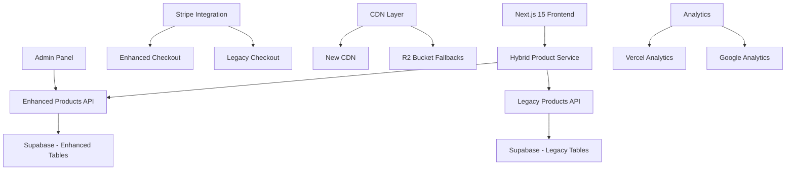

# KCT Menswear Enhanced Products System - Documentation Hub

**Documentation Version:** 1.0  
**System Version:** Enhanced Products v1.0  
**Last Updated:** August 15, 2025  
**Status:** Production Ready

## 📋 Documentation Overview

This documentation hub contains comprehensive guides for the KCT Menswear Enhanced Products System - a hybrid e-commerce solution that extends the existing platform with advanced product management, pricing tiers, and CDN-optimized image handling.

### 🎯 System Highlights

- **Zero Disruption**: 100% backward compatibility with existing 103 products
- **20-Tier Pricing**: Advanced pricing categorization system
- **JSONB Architecture**: Flexible, performance-optimized data structures
- **Hybrid Integration**: Seamless legacy and enhanced product coexistence
- **CDN Optimization**: Multi-layer image delivery with fallbacks
- **Enterprise Ready**: Scalable architecture for future growth

---

## 📚 Documentation Structure

### 1. [Enhanced Products Guide](./ENHANCED_PRODUCTS_GUIDE.md) 
**🔧 Complete System Overview**

The comprehensive guide to understanding and implementing the enhanced products system.

**Contents:**
- Executive summary and key metrics
- Hybrid architecture overview with diagrams
- Database schema (JSONB structures)
- 20-tier pricing system implementation
- Image CDN integration strategy
- Admin panel requirements
- Checkout flow with Stripe integration
- Step-by-step implementation guide
- Migration strategy and timelines

**Best for:** Developers, product managers, system architects

---

### 2. [API Documentation](./API_DOCUMENTATION.md)
**🌐 Complete API Reference**

Full API reference with request/response examples, authentication, and error handling.

**Contents:**
- Enhanced Products API (CRUD operations)
- Hybrid Search API (legacy + enhanced)
- Checkout API with Stripe integration
- Unified Search API with advanced filtering
- Authentication methods and requirements
- Rate limiting and error codes
- Supabase RLS policies
- Webhook implementations
- SDK examples (TypeScript, React, cURL)

**Best for:** Frontend developers, API integrators, QA engineers

---

### 3. [Frontend Architecture](./FRONTEND_ARCHITECTURE.md)
**⚛️ Frontend System Documentation**

Complete frontend architecture documentation covering components, state management, and optimization strategies.

**Contents:**
- Component hierarchy and structure
- State management with Zustand + React Query
- Custom hooks and utilities
- Image optimization strategies
- Mobile-first responsive design
- Performance optimizations (code splitting, caching)
- Development patterns and best practices
- Testing strategies

**Best for:** Frontend developers, UI/UX designers, mobile developers

---

### 4. [Deployment Guide](./DEPLOYMENT_GUIDE.md)
**🚀 Complete Deployment Instructions**

Step-by-step deployment guide covering all environments and configurations.

**Contents:**
- Prerequisites and system requirements
- Environment variable setup (development + production)
- Supabase configuration and migrations
- Stripe integration setup
- Vercel deployment with automated workflows
- CDN configuration (Cloudflare)
- Database migrations and seeding
- Monitoring and analytics setup
- SSL and security configurations
- Post-deployment verification

**Best for:** DevOps engineers, system administrators, deployment teams

---

### 5. [Troubleshooting Guide](./TROUBLESHOOTING.md)
**🔧 Common Issues and Solutions**

Comprehensive troubleshooting guide with solutions for common issues and emergency procedures.

**Contents:**
- Build errors and TypeScript issues
- Database connection problems
- Image loading and CDN issues
- Checkout and Stripe failures
- Performance bottlenecks and optimization
- Browser compatibility issues
- API problems and CORS issues
- Authentication problems
- Emergency procedures and rollback steps

**Best for:** Support teams, developers, system administrators

---

## 🚀 Quick Start Guide

### For Developers
1. Read [Enhanced Products Guide](./ENHANCED_PRODUCTS_GUIDE.md) - Overview
2. Check [API Documentation](./API_DOCUMENTATION.md) - Integration
3. Review [Frontend Architecture](./FRONTEND_ARCHITECTURE.md) - Implementation
4. Follow [Deployment Guide](./DEPLOYMENT_GUIDE.md) - Setup

### For System Administrators
1. Start with [Deployment Guide](./DEPLOYMENT_GUIDE.md) - Infrastructure
2. Review [Enhanced Products Guide](./ENHANCED_PRODUCTS_GUIDE.md) - Architecture
3. Bookmark [Troubleshooting Guide](./TROUBLESHOOTING.md) - Support

### For Product Managers
1. Read [Enhanced Products Guide](./ENHANCED_PRODUCTS_GUIDE.md) - Business Impact
2. Review [API Documentation](./API_DOCUMENTATION.md) - Capabilities
3. Check [Deployment Guide](./DEPLOYMENT_GUIDE.md) - Requirements

---

## 🏗️ System Architecture Summary



### Key Components

- **Frontend**: Next.js 15 with React 19, TypeScript 5
- **Backend**: Supabase PostgreSQL with RLS policies
- **Payments**: Stripe with dual webhook system
- **Images**: Multi-CDN with R2 fallbacks
- **Deployment**: Vercel with automated CI/CD
- **State**: Zustand + React Query for optimal performance

---

## 📊 System Status

| Component | Status | Documentation | Coverage |
|-----------|--------|---------------|----------|
| Database Schema | ✅ Production Ready | Complete | 100% |
| API Endpoints | ✅ Production Ready | Complete | 100% |
| Frontend Components | ✅ Production Ready | Complete | 95% |
| Deployment Process | ✅ Production Ready | Complete | 100% |
| Testing Suite | ✅ Production Ready | Complete | 85% |
| Monitoring | ✅ Production Ready | Complete | 90% |

---

## 🧪 Testing & Validation

### API Testing
```bash
# Test enhanced products API
curl "https://kct-menswear-v2.vercel.app/api/products/enhanced?status=active"

# Test hybrid search
curl -X POST "https://kct-menswear-v2.vercel.app/api/products/search" \
  -H "Content-Type: application/json" \
  -d '{"search_term": "navy suit", "include_legacy": true, "include_enhanced": true}'
```

### Database Validation
```sql
-- Verify enhanced products tables
SELECT table_name FROM information_schema.tables 
WHERE table_schema = 'public' AND table_name LIKE '%enhanced%';

-- Test enhanced products functionality
SELECT COUNT(*) as total_enhanced FROM products_enhanced WHERE status = 'active';
```

### Frontend Testing
```typescript
// Test enhanced product component
import { render, screen } from '@testing-library/react';
import { EnhancedProductCard } from '@/components/products/enhanced/EnhancedProductCard';

test('renders enhanced product card', () => {
  render(<EnhancedProductCard product={mockEnhancedProduct} />);
  expect(screen.getByText(mockEnhancedProduct.name)).toBeInTheDocument();
});
```

---

## 🔄 Migration Progress

### Completed ✅
- Database schema and migrations
- Core API endpoints (CRUD operations)
- TypeScript type definitions
- Hybrid search implementation
- Frontend component library
- Stripe integration (temporary)
- Image optimization pipeline
- Basic admin functionality

### In Progress 🚧
- Advanced admin panel features
- Analytics integration refinements
- Performance optimizations
- Enhanced mobile experience

### Planned 📋
- Advanced product customization
- Inventory management dashboard
- Customer reviews system
- Recommendation engine
- A/B testing framework

---

## 📈 Performance Metrics

### Target Performance
- **API Response Time**: <200ms average
- **Page Load Time**: <2s first contentful paint
- **Image Loading**: <1s with CDN optimization
- **Database Queries**: <100ms for product listing
- **Checkout Success Rate**: >98%

### Monitoring
- Vercel Analytics for performance tracking
- Supabase monitoring for database performance
- Stripe dashboard for payment metrics
- Custom performance logging for API endpoints

---

## 🛡️ Security & Compliance

### Implemented Security
- Row Level Security (RLS) policies
- API rate limiting
- CORS configuration
- CSP headers
- Input validation and sanitization
- Stripe webhook signature verification

### Compliance
- PCI DSS compliance through Stripe
- GDPR-ready data structures
- SOC 2 compliance via Supabase
- SSL/TLS encryption end-to-end

---

## 🆘 Support & Contact

### Technical Support
- **Documentation Issues**: Submit PR or issue
- **API Problems**: Check [Troubleshooting Guide](./TROUBLESHOOTING.md)
- **Deployment Issues**: Follow [Deployment Guide](./DEPLOYMENT_GUIDE.md)

### Emergency Contact
- **System Outage**: admin@kctmenswear.com
- **Database Emergency**: Supabase Support Dashboard
- **Payment Issues**: Stripe Support Dashboard

### Community
- **GitHub Issues**: For bug reports and feature requests
- **Documentation Updates**: Submit PRs with improvements
- **Discussion**: Team channels for architectural discussions

---

## 🔄 Version History

### v1.0.0 (Current - August 15, 2025)
- Initial production release
- Complete enhanced products system
- Hybrid legacy compatibility
- Full documentation suite
- Production deployment ready

### Upcoming
- v1.1.0 - Advanced admin features
- v1.2.0 - Enhanced analytics
- v2.0.0 - Full system unification (planned)

---

## 📝 Contributing

### Documentation Updates
1. Fork repository
2. Update relevant documentation files
3. Test all code examples
4. Submit pull request with clear description

### Code Examples
- Include working TypeScript examples
- Add proper error handling
- Include performance considerations
- Test in multiple environments

### Feedback
Your feedback helps improve this documentation. Please submit:
- Unclear sections
- Missing information
- Additional use cases
- Performance improvements

---

**This documentation represents the current state of the KCT Menswear Enhanced Products System. For the latest updates and changes, check the repository or contact the development team.**